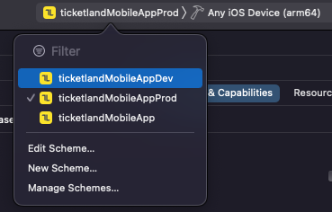
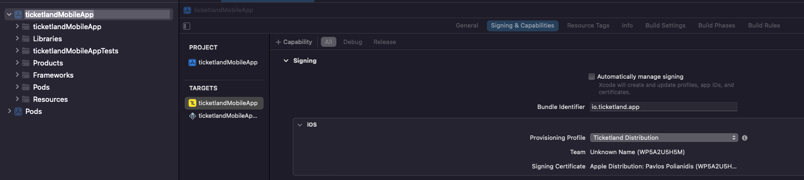
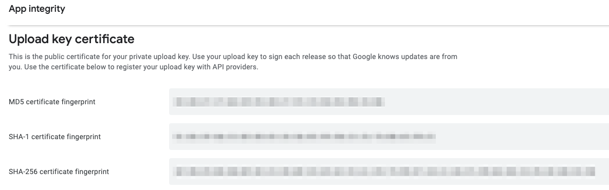
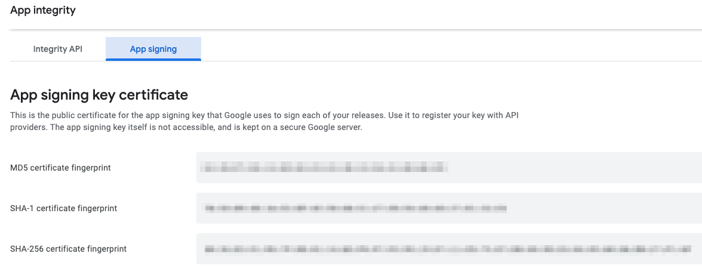

ticketland-mobile-app
-----

## IOS Build
Prior to executing these commands you need to download the `GoogleService-Info.plist` file from the firebase project located on app setting on the firebase console. Then add it to the ios folder `./ios`

For the IOS app to run you need to run these commands
- yarn install
- cd ios && pod install
- yarn start(starting the bunlder)
- yarn ios(building and starting the app)

## Android Build
Prior to executing these commands you need to download the `google-services.json` file from the firebase project located on app setting on the firebase console. Then add it to the android app folder `./android/app`

For the android app to run you need to run these commands
- yarn install
- yarn start(starting the bundler)
- yarn android(building and starting the app)

no need fot further linking since the react-native version we are using has auto-linking for the android

## Env configuration

The envs for both app where set based on this article
https://medium.com/armenotech/configure-environment-variables-with-react-native-config-for-ios-and-android-7079c0842d8b

Attention!!!
for the env to work on ios `pod install` should be executed for the tmp-xconfig to be created


## Release
### IOS:
https://reactnative.dev/docs/publishing-to-app-store

Choose the correct scheme for the env variable and set the target device to  `Any IOS device(arm64)` as shown to the picture below.Then select to Product>Archive.
In order to see the archived app you can go to Window>Organizer.



Make sure that on the Signing & Capabilities of the app you have set the bundle Identifier correctly(same as the appCenter) and the correct Provisioning profile



On the organizer window hit Distribute app and follow the process


### Android:
https://reactnative.dev/docs/signed-apk-android

### Generating an upload key
Android requires your application binary to be signed with an upload key before it is uploaded to Google Play.

On macOS, if you're not sure where your JDK bin folder is, then perform the following command to find it:
```
/usr/libexec/java_home
```

It will output the directory of the JDK, which will look something like this:
```
/Library/Java/JavaVirtualMachines/jdkX.X.X_XXX.jdk/Contents/Home
```

Navigate to that directory by using the command cd /your/jdk/path and use the keytool command with sudo permission as shown below:
```
sudo keytool -genkey -v -keystore my-upload-key.keystore -alias my-key-alias -keyalg RSA -keysize 2048 -validity 10000
```

1. Place the my-upload-key.keystore file under the android/app directory in your project folder.
2. Edit the file ~/.gradle/gradle.properties or android/gradle.properties, and add the following (replace ***** with the correct keystore password, alias and key password),
   
### Setting up Gradle variables

```
MYAPP_UPLOAD_STORE_FILE=my-upload-key.keystore
MYAPP_UPLOAD_KEY_ALIAS=my-key-alias
MYAPP_UPLOAD_STORE_PASSWORD=*****
MYAPP_UPLOAD_KEY_PASSWORD=*****
```

### Adding signing config to your app's Gradle config
Setup release builds to be signed using upload key. Edit the file android/app/build.gradle in your project folder, and add the signing config.
```
...
android {
    ...
    defaultConfig { ... }
    signingConfigs {
        release {
            if (project.hasProperty('MYAPP_UPLOAD_STORE_FILE')) {
                storeFile file(MYAPP_UPLOAD_STORE_FILE)
                storePassword MYAPP_UPLOAD_STORE_PASSWORD
                keyAlias MYAPP_UPLOAD_KEY_ALIAS
                keyPassword MYAPP_UPLOAD_KEY_PASSWORD
            }
        }
    }
    buildTypes {
        release {
            ...
            signingConfig signingConfigs.release
        }
    }
}
...
```

### Generating the release AAB
```
yarn android:build
```

The generated AAB can be found under android/app/build/outputs/bundle/release/app-release.aab
### Testing the release build of your app
```
npx react-native run-android --mode=release
```

Attention!!! Our project utilizes firebase. For it to work you need to add SHA certificate fingerprints on your android apps settings on firebase console.
In order to get the SHA1 key for the debug you need to run
```
cd android && ./gradlew signingReport
```
and copy the SHA1 from the `Variant: debug`

For the release to work you need to copy the SHA1 keys from Google Play Console on App Integrity Section

copy both the SHA-1 certificate fingerprint for the App signing and the Upload



## Logging releases
In order to log the released version two commands have been added
- yarn ios:log
- yarn android:log

In case of error:
 ```
 error No active iOS device found
 ```` 
on yarn ios:log you can use the console provided on mac os as described here
https://stackoverflow.com/questions/47172640/no-active-ios-device-found-when-trying-to-access-simulator-logs
